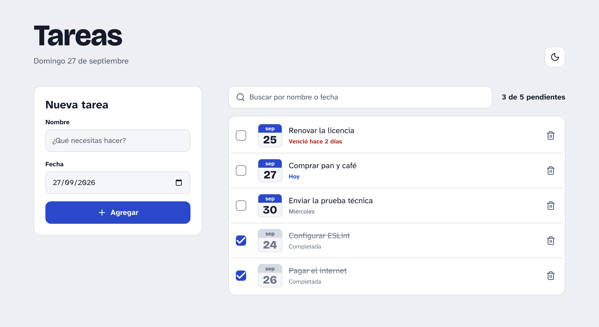

# Tareas

A to-do list for planning tasks by date, built with React, Redux Toolkit and Tailwind CSS. The interface is in Spanish.

**Live demo: [to-do-list-app.cesarrivas.dev](https://to-do-list-app.cesarrivas.dev)**

<picture>
  <source media="(prefers-color-scheme: dark)" srcset="docs/screenshot-dark.png" />
  
</picture>

## Features

- Add tasks with a name and a due date, with validation messages next to each field.
- Complete tasks (struck through and moved to the end) and delete them.
- Each task shows its date on a small calendar sheet, plus when it's due: "Hoy", the weekday, or how long ago it expired.
- Search by name or date (`30/09`, `miércoles`, `hoy`…), debounced 300 ms.
- Tasks and the theme are saved in the browser and survive a reload.
- Light and dark themes that follow the system until you pick one.
- One column on mobile, two on desktop.

## Tech stack

- **UI:** React 19 with the React Compiler, TypeScript, Tailwind CSS 4, Lucide icons
- **State:** Redux Toolkit, redux-persist
- **Routing:** React Router, with 404 and error pages
- **Animations:** AutoAnimate
- **Tests:** Vitest, React Testing Library
- **Tooling:** Vite, ESLint, Prettier, Husky with commitlint, GitHub Actions CI, deployed on Vercel

## Getting started

Requires Node.js 24 (see `.nvmrc`).

```bash
npm install
npm run dev
```

| Script             | What it does                          |
| ------------------ | ------------------------------------- |
| `npm run dev`      | Starts the development server         |
| `npm run build`    | Type-checks and builds for production |
| `npm run preview`  | Serves the production build           |
| `npm run lint`     | Runs ESLint                           |
| `npm test`         | Runs the tests in watch mode          |
| `npm run test:run` | Runs the tests once                   |
| `npm run coverage` | Runs the tests with a coverage report |

## Project structure

```
src/
├── components/   Header, plus generic UI in ui/ (Button, Input, Checkbox…)
├── features/
│   ├── tasks/    Tasks slice, search, validation, useTaskSearch and their components
│   └── theme/    Theme slice, useTheme and ThemeToggle
├── hooks/        Generic hooks: useDebouncedState, useToday
├── pages/        Tasks page, 404 and error pages
├── store/        Store setup, persistence and typed hooks
├── test/         Test setup, render helpers and factories
└── utils/        Dates, class names and the AutoAnimate ref
```

## Technical decisions

- **State:** tasks (normalized with `createEntityAdapter`) and the theme preference live in Redux and are saved to localStorage with redux-persist. The search query and the form fields are short-lived UI state, so they stay in their components.
- **Memoization:** the React Compiler memoizes components and values, so there's no manual `useMemo`, `useCallback` or `memo`. Selectors that derive lists still use `createSelector`, because `useSelector` compares results by reference.
- **Search:** names match anywhere; dates match from the start of their words (`30/09`, `2026-09-30`, `30 de septiembre`, `miércoles`, `hoy`), so a search never finds a task by a part of its date that isn't on screen. Typing is debounced, while clearing the search applies at once.
- **Theme:** colors are design tokens defined as Tailwind theme variables and redefined under a `.dark` class. A small script in `index.html` applies the saved theme before the first paint, so the wrong one doesn't flash.
- **Animations:** AutoAnimate animates tasks as they're added, deleted, filtered or reordered, and the switch between the list and its empty states. It's attached with a ref callback that cleans up after itself, because the library's React hook registers twice under StrictMode and its move animations cancel each other.

## Demo

[To-Do List App / Quick demo part 1](https://youtu.be/7Pm52-JEqiE)
[To-Do List App / Quick demo part 1](https://youtu.be/drXn56d8mjA)

## Accessibility

- Text is set in [Atkinson Hyperlegible Next](https://www.brailleinstitute.org/freefont/), a typeface from the Braille Institute designed to tell similar characters apart (`I`, `l`, `1`, `O`, `0`), which helps readers with low vision. Headings and day numbers use Bricolage Grotesque.
- Text meets WCAG AA contrast in both themes. Completed tasks don't rely on color alone: they're struck through and labeled "Completada".
- Controls have 44 px touch targets and a visible focus ring. Focus goes to the first field with an error, back to the name after adding a task, and stays on a task's checkbox when completing it moves the task.
- Fields, errors and tasks are labeled for screen readers, and the pending count is announced when it changes.
- Animations are turned off for users who prefer reduced motion.

## Testing

Unit tests cover the slices, search, validation, dates and hooks. Integration tests render the page with a real store to add, complete, delete and search tasks, and persistence is tested with redux-persist's real storage. CI runs lint, tests and the production build on every pull request.
